# EduCentre Functional Flow Diagrams (Mermaid)

Use these in Markdown viewers that support Mermaid (GitHub, Notion, Obsidian, etc.).

## 1) High-Level Module Map
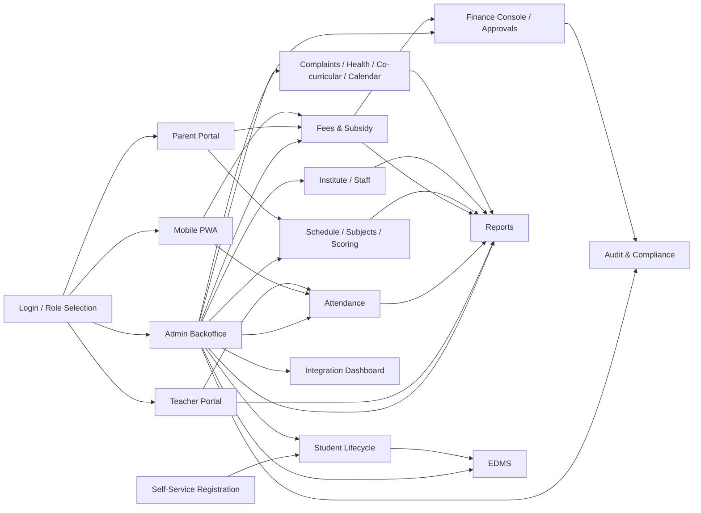
```mermaid
flowchart LR
  A[Login / Role Selection] --> B[Admin Backoffice]
  A --> C[Parent Portal]
  A --> T[Teacher Portal]
  A --> M[Mobile PWA]
  R[Self-Service Registration] --> D[Student Lifecycle]
  B --> D
  B --> E[Attendance]
  B --> F[Fees & Subsidy]
  B --> SC[Schedule / Subjects / Scoring]
  B --> G[Finance Console / Approvals]
  B --> H[Audit & Compliance]
  B --> I[Reports]
  B --> J[Institute / Staff]
  B --> K[Complaints / Health / Co-curricular / Calendar]
  B --> EDMS[EDMS]
  B --> INT[Integration Dashboard]
  C --> F
  C --> SC
  M --> F
  M --> E
  T --> E
  T --> I
  D --> EDMS
  F --> G
  G --> H
  E --> I
  F --> I
  SC --> I
  J --> I
  K --> I
```

## 2) Self-Service Registration Module
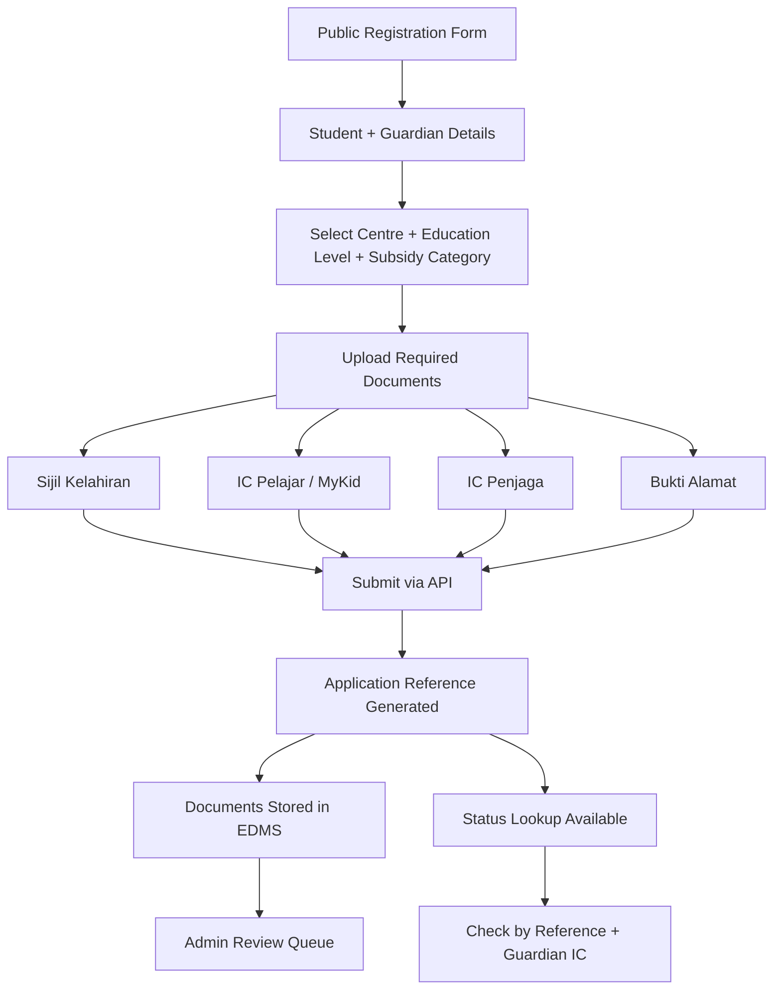
```mermaid
flowchart TD
  A[Public Registration Form] --> B[Student + Guardian Details]
  B --> C[Select Centre + Education Level + Subsidy Category]
  C --> D[Upload Required Documents]
  D --> D1[Sijil Kelahiran]
  D --> D2[IC Pelajar / MyKid]
  D --> D3[IC Penjaga]
  D --> D4[Bukti Alamat]
  D1 --> E[Submit via API]
  D2 --> E
  D3 --> E
  D4 --> E
  E --> F[Application Reference Generated]
  F --> G[Documents Stored in EDMS]
  F --> H[Status Lookup Available]
  H --> I[Check by Reference + Guardian IC]
  G --> J[Admin Review Queue]
```

## 3) Student Lifecycle Module
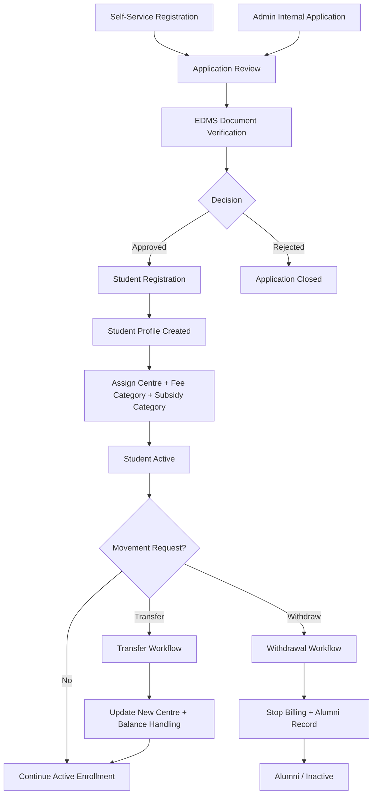
```mermaid
flowchart TD
  A1[Self-Service Registration] --> B
  A2[Admin Internal Application] --> B
  B[Application Review] --> B1[EDMS Document Verification]
  B1 --> C{Decision}
  C -->|Approved| D[Student Registration]
  C -->|Rejected| Z[Application Closed]
  D --> E[Student Profile Created]
  E --> F[Assign Centre + Fee Category + Subsidy Category]
  F --> G[Student Active]
  G --> H{Movement Request?}
  H -->|Transfer| I[Transfer Workflow]
  H -->|Withdraw| J[Withdrawal Workflow]
  H -->|No| K[Continue Active Enrollment]
  I --> L[Update New Centre + Balance Handling]
  J --> M[Stop Billing + Alumni Record]
  L --> K
  M --> N[Alumni / Inactive]
```

## 4) Attendance Module
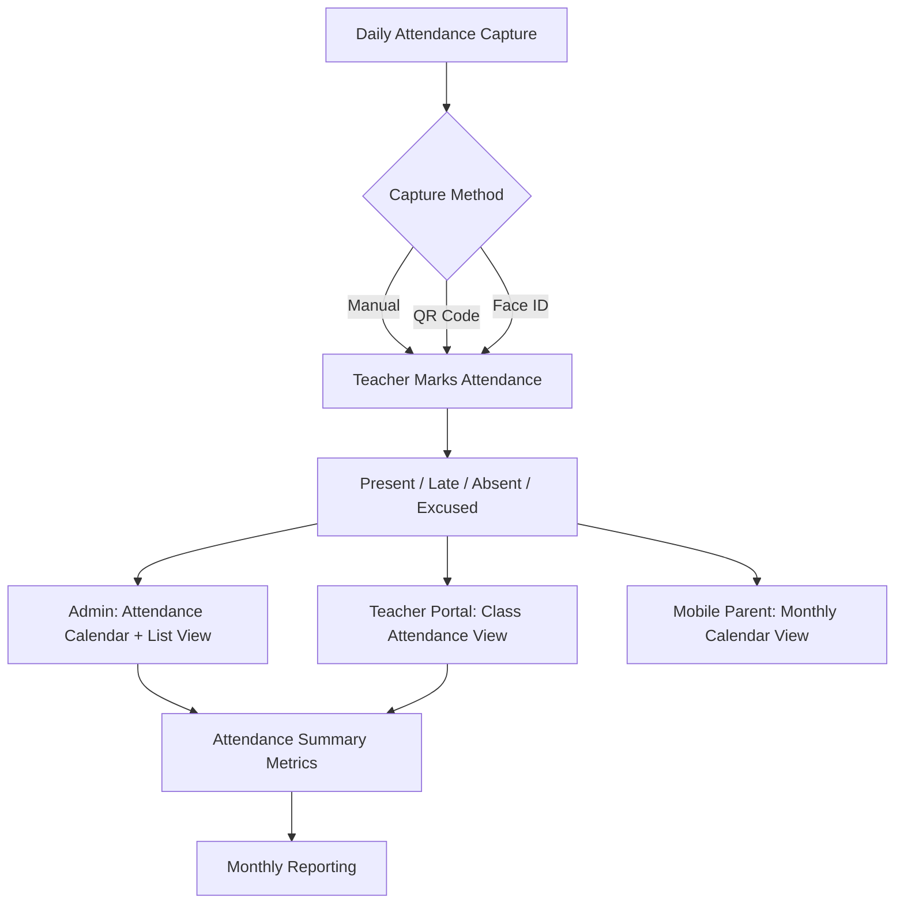
```mermaid
flowchart TD
  A[Daily Attendance Capture] --> A1{Capture Method}
  A1 -->|Manual| B[Teacher Marks Attendance]
  A1 -->|QR Code| B
  A1 -->|Face ID| B
  B --> C[Present / Late / Absent / Excused]
  C --> D[Admin: Attendance Calendar + List View]
  C --> E[Teacher Portal: Class Attendance View]
  C --> F[Mobile Parent: Monthly Calendar View]
  D --> G[Attendance Summary Metrics]
  E --> G
  G --> H[Monthly Reporting]
```

## 5) Fees & Subsidy Module
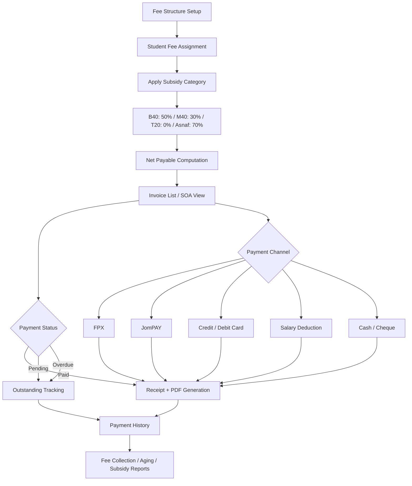
```mermaid
flowchart TD
  A[Fee Structure Setup] --> B[Student Fee Assignment]
  B --> C[Apply Subsidy Category]
  C --> C1[B40: 50% / M40: 30% / T20: 0% / Asnaf: 70%]
  C1 --> D[Net Payable Computation]
  D --> E[Invoice List / SOA View]
  E --> F{Payment Status}
  F -->|Paid| G[Receipt + PDF Generation]
  F -->|Pending| H[Outstanding Tracking]
  F -->|Overdue| H
  G --> I[Payment History]
  H --> I
  I --> J[Fee Collection / Aging / Subsidy Reports]
  E --> K{Payment Channel}
  K --> K1[FPX]
  K --> K2[JomPAY]
  K --> K3[Credit / Debit Card]
  K --> K4[Salary Deduction]
  K --> K5[Cash / Cheque]
  K1 --> G
  K2 --> G
  K3 --> G
  K4 --> G
  K5 --> G
```

## 6) Approval & Audit Module
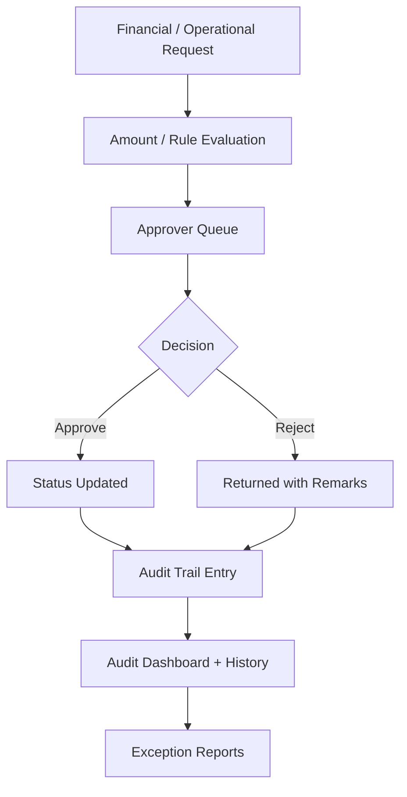
```mermaid
flowchart TD
  A[Financial / Operational Request] --> B[Amount / Rule Evaluation]
  B --> C[Approver Queue]
  C --> D{Decision}
  D -->|Approve| E[Status Updated]
  D -->|Reject| F[Returned with Remarks]
  E --> G[Audit Trail Entry]
  F --> G
  G --> H[Audit Dashboard + History]
  H --> I[Exception Reports]
```

## 7) Institute Management Module
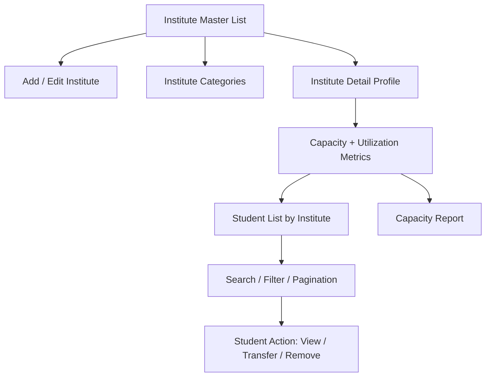
```mermaid
flowchart TD
  A[Institute Master List] --> B[Add / Edit Institute]
  A --> C[Institute Categories]
  A --> D[Institute Detail Profile]
  D --> E[Capacity + Utilization Metrics]
  E --> F[Student List by Institute]
  F --> G[Search / Filter / Pagination]
  G --> H[Student Action: View / Transfer / Remove]
  E --> I[Capacity Report]
```

## 8) Staff Management Module
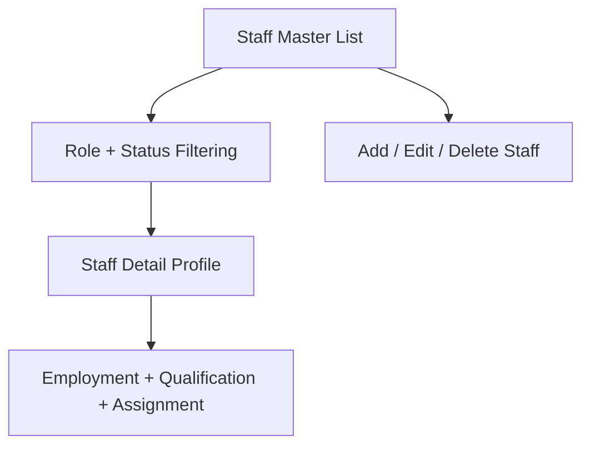
```mermaid
flowchart TD
  A[Staff Master List] --> B[Role + Status Filtering]
  B --> C[Staff Detail Profile]
  C --> D[Employment + Qualification + Assignment]
  A --> E[Add / Edit / Delete Staff]
```

## 9) Schedule & Subjects Module
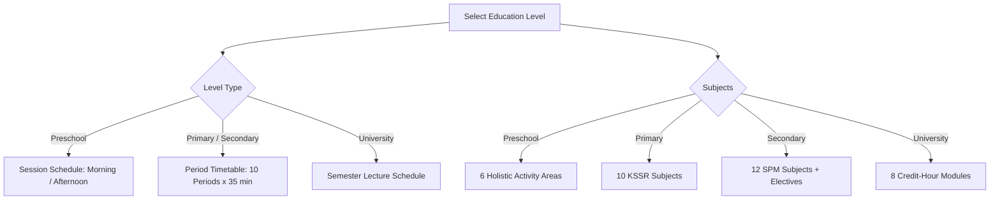
```mermaid
flowchart TD
  A[Select Education Level] --> B{Level Type}
  B -->|Preschool| C[Session Schedule: Morning / Afternoon]
  B -->|Primary / Secondary| D[Period Timetable: 10 Periods x 35 min]
  B -->|University| E[Semester Lecture Schedule]
  A --> F{Subjects}
  F -->|Preschool| G[6 Holistic Activity Areas]
  F -->|Primary| H[10 KSSR Subjects]
  F -->|Secondary| I[12 SPM Subjects + Electives]
  F -->|University| J[8 Credit-Hour Modules]
```

## 10) Scoring / Academic Module
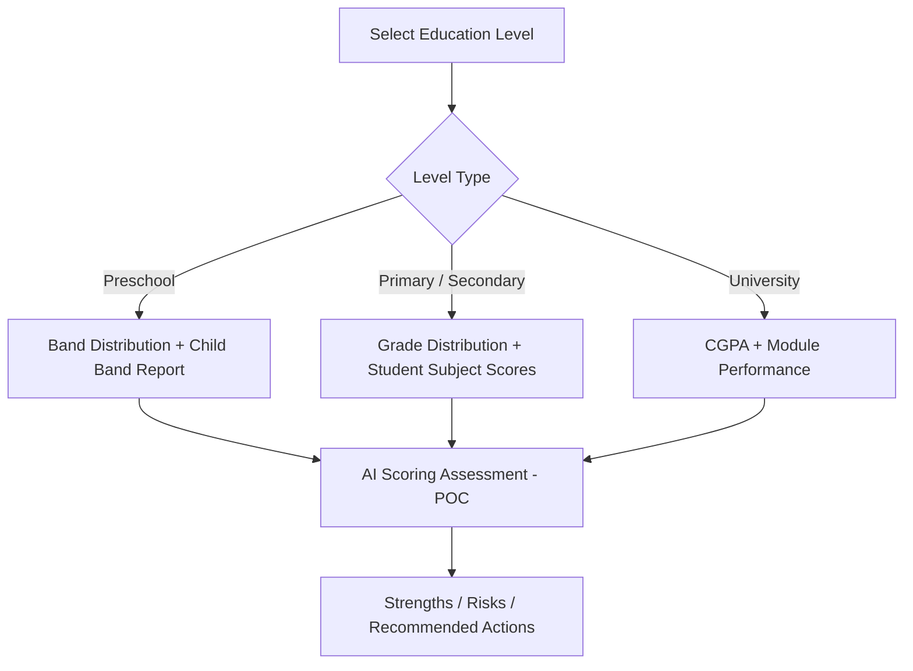
```mermaid
flowchart TD
  A[Select Education Level] --> B{Level Type}
  B -->|Preschool| C[Band Distribution + Child Band Report]
  B -->|Primary / Secondary| D[Grade Distribution + Student Subject Scores]
  B -->|University| E[CGPA + Module Performance]
  C --> F[AI Scoring Assessment - POC]
  D --> F
  E --> F
  F --> G[Strengths / Risks / Recommended Actions]
```

## 11) Complaints Module
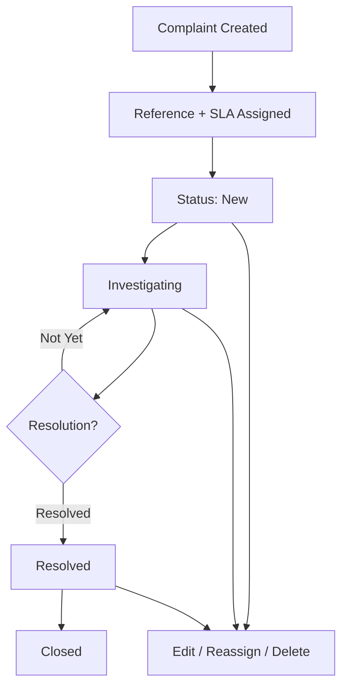
```mermaid
flowchart TD
  A[Complaint Created] --> B[Reference + SLA Assigned]
  B --> C[Status: New]
  C --> D[Investigating]
  D --> E{Resolution?}
  E -->|Resolved| F[Resolved]
  E -->|Not Yet| D
  F --> G[Closed]
  C --> H[Edit / Reassign / Delete]
  D --> H
  F --> H
```

## 12) Health Module
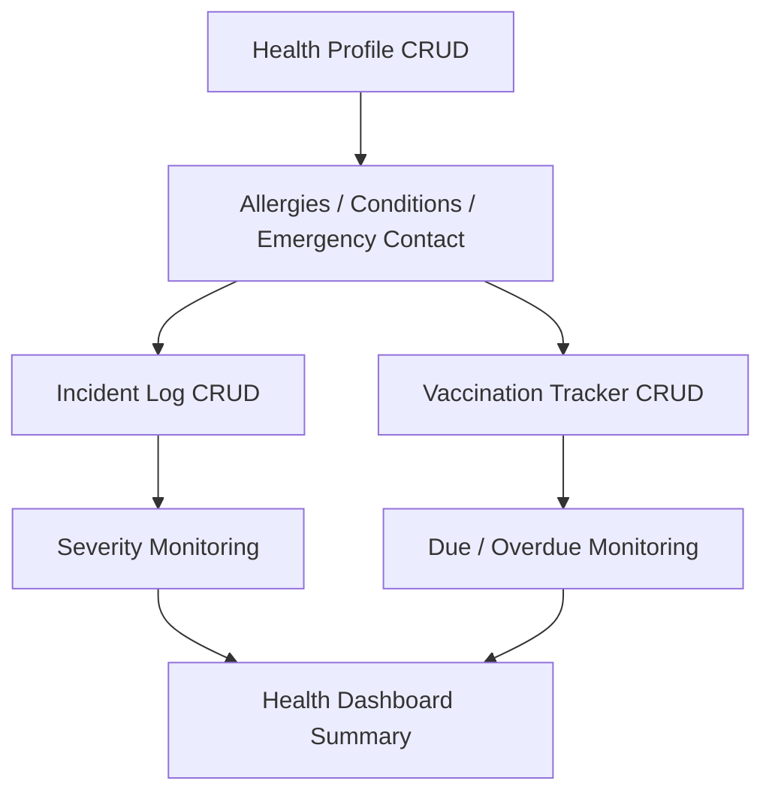
```mermaid
flowchart TD
  A[Health Profile CRUD] --> B[Allergies / Conditions / Emergency Contact]
  B --> C[Incident Log CRUD]
  B --> D[Vaccination Tracker CRUD]
  C --> E[Severity Monitoring]
  D --> F[Due / Overdue Monitoring]
  E --> G[Health Dashboard Summary]
  F --> G
```

## 13) Co-curricular Module
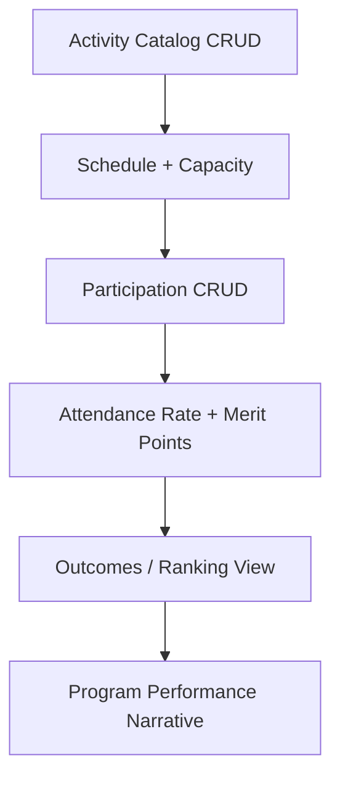
```mermaid
flowchart TD
  A[Activity Catalog CRUD] --> B[Schedule + Capacity]
  B --> C[Participation CRUD]
  C --> D[Attendance Rate + Merit Points]
  D --> E[Outcomes / Ranking View]
  E --> F[Program Performance Narrative]
```

## 14) Institutional Calendar Module
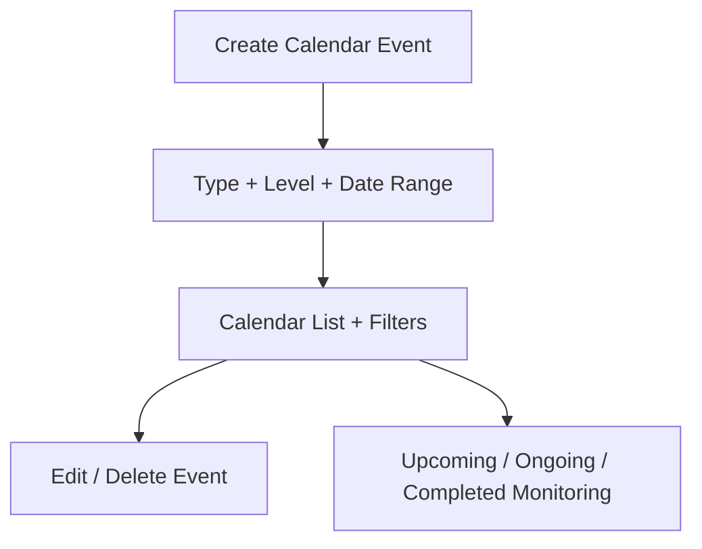
```mermaid
flowchart TD
  A[Create Calendar Event] --> B[Type + Level + Date Range]
  B --> C[Calendar List + Filters]
  C --> D[Edit / Delete Event]
  C --> E[Upcoming / Ongoing / Completed Monitoring]
```

## 15) EDMS (Electronic Document Management)
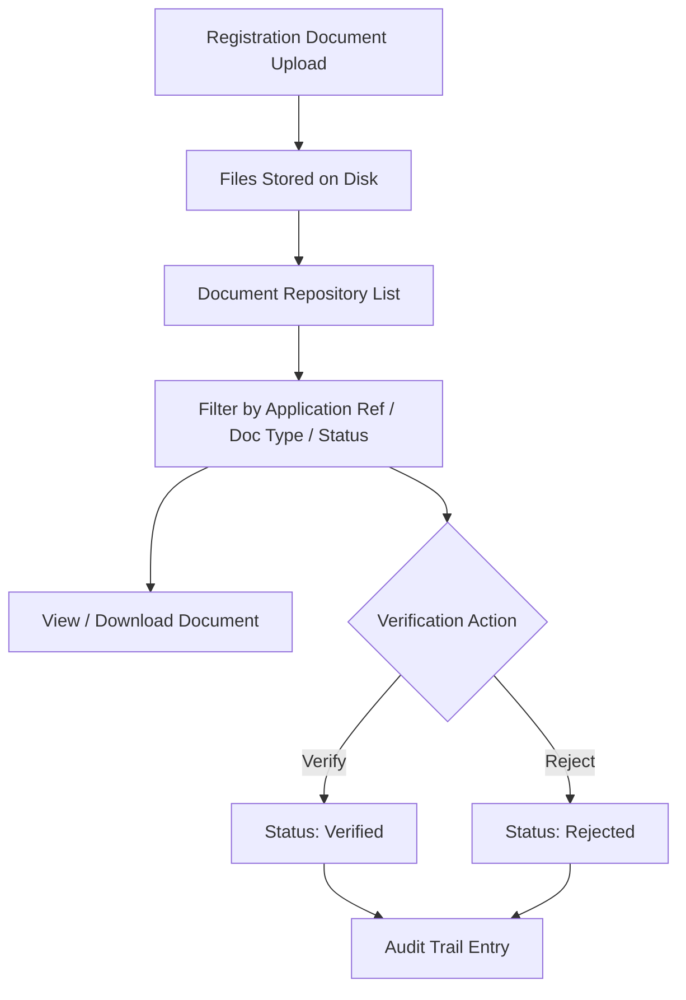
```mermaid
flowchart TD
  A[Registration Document Upload] --> B[Files Stored on Disk]
  B --> C[Document Repository List]
  C --> D[Filter by Application Ref / Doc Type / Status]
  D --> E[View / Download Document]
  D --> F{Verification Action}
  F -->|Verify| G[Status: Verified]
  F -->|Reject| H[Status: Rejected]
  G --> I[Audit Trail Entry]
  H --> I
```

## 16) Reporting Module
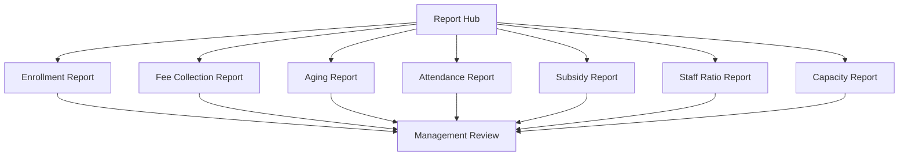
```mermaid
flowchart TD
  A[Report Hub] --> B[Enrollment Report]
  A --> C[Fee Collection Report]
  A --> D[Aging Report]
  A --> E[Attendance Report]
  A --> F[Subsidy Report]
  A --> G[Staff Ratio Report]
  A --> H[Capacity Report]
  B --> I[Management Review]
  C --> I
  D --> I
  E --> I
  F --> I
  G --> I
  H --> I
```

## 17) Parent Portal (Desktop)
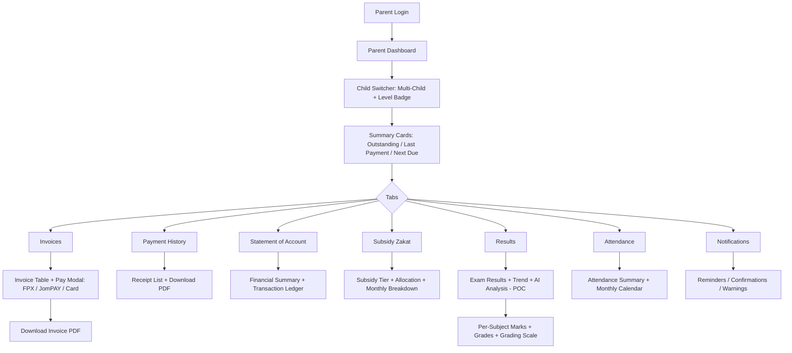
```mermaid
flowchart TD
  A[Parent Login] --> B[Parent Dashboard]
  B --> CS[Child Switcher: Multi-Child + Level Badge]
  CS --> SC[Summary Cards: Outstanding / Last Payment / Next Due]
  SC --> T{Tabs}
  T --> T1[Invoices]
  T --> T2[Payment History]
  T --> T3[Statement of Account]
  T --> T4[Subsidy Zakat]
  T --> T5[Results]
  T --> T6[Attendance]
  T --> T7[Notifications]
  T1 --> T1a[Invoice Table + Pay Modal: FPX / JomPAY / Card]
  T1a --> T1b[Download Invoice PDF]
  T2 --> T2a[Receipt List + Download PDF]
  T3 --> T3a[Financial Summary + Transaction Ledger]
  T4 --> T4a[Subsidy Tier + Allocation + Monthly Breakdown]
  T5 --> T5a[Exam Results + Trend + AI Analysis - POC]
  T5a --> T5b[Per-Subject Marks + Grades + Grading Scale]
  T6 --> T6a[Attendance Summary + Monthly Calendar]
  T7 --> T7a[Reminders / Confirmations / Warnings]
```

## 18) Teacher Portal (Desktop)
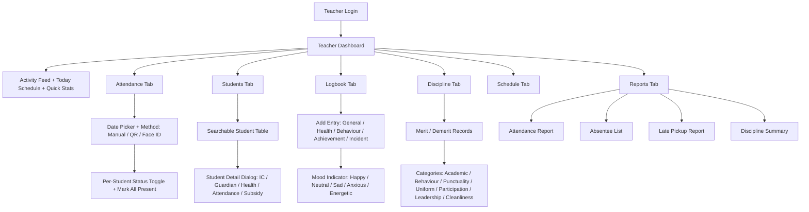
```mermaid
flowchart TD
  A[Teacher Login] --> B[Teacher Dashboard]
  B --> C[Activity Feed + Today Schedule + Quick Stats]
  B --> D[Attendance Tab]
  B --> E[Students Tab]
  B --> F[Logbook Tab]
  B --> G[Discipline Tab]
  B --> H[Schedule Tab]
  B --> I[Reports Tab]
  D --> D1[Date Picker + Method: Manual / QR / Face ID]
  D1 --> D2[Per-Student Status Toggle + Mark All Present]
  E --> E1[Searchable Student Table]
  E1 --> E2[Student Detail Dialog: IC / Guardian / Health / Attendance / Subsidy]
  F --> F1[Add Entry: General / Health / Behaviour / Achievement / Incident]
  F1 --> F2[Mood Indicator: Happy / Neutral / Sad / Anxious / Energetic]
  G --> G1[Merit / Demerit Records]
  G1 --> G2[Categories: Academic / Behaviour / Punctuality / Uniform / Participation / Leadership / Cleanliness]
  I --> I1[Attendance Report]
  I --> I2[Absentee List]
  I --> I3[Late Pickup Report]
  I --> I4[Discipline Summary]
```

## 19) Mobile PWA (Parent)
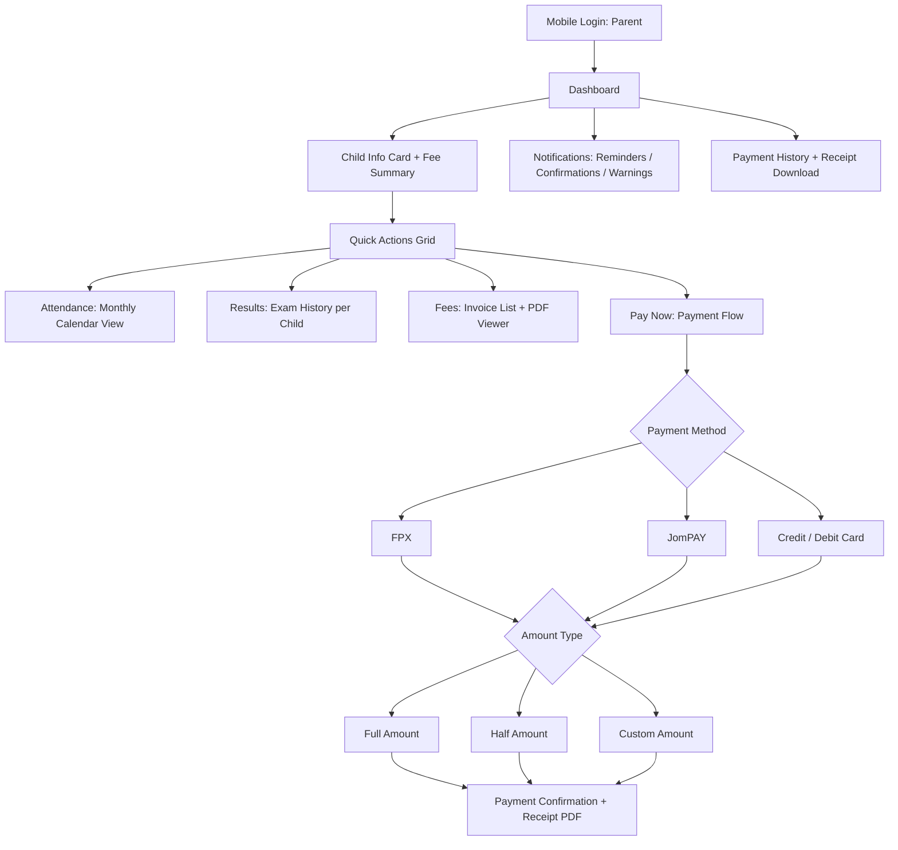
```mermaid
flowchart TD
  A[Mobile Login: Parent] --> B[Dashboard]
  B --> C[Child Info Card + Fee Summary]
  C --> D[Quick Actions Grid]
  D --> D1[Attendance: Monthly Calendar View]
  D --> D2[Results: Exam History per Child]
  D --> D3[Fees: Invoice List + PDF Viewer]
  D --> D4[Pay Now: Payment Flow]
  D4 --> E{Payment Method}
  E --> E1[FPX]
  E --> E2[JomPAY]
  E --> E3[Credit / Debit Card]
  E1 --> F{Amount Type}
  E2 --> F
  E3 --> F
  F --> F1[Full Amount]
  F --> F2[Half Amount]
  F --> F3[Custom Amount]
  F1 --> G[Payment Confirmation + Receipt PDF]
  F2 --> G
  F3 --> G
  B --> H[Notifications: Reminders / Confirmations / Warnings]
  B --> I[Payment History + Receipt Download]
```

## 20) Mobile PWA (Teacher)
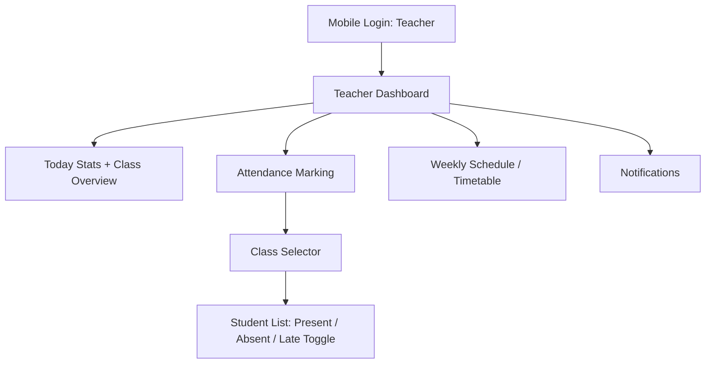
```mermaid
flowchart TD
  A[Mobile Login: Teacher] --> B[Teacher Dashboard]
  B --> C[Today Stats + Class Overview]
  B --> D[Attendance Marking]
  D --> D1[Class Selector]
  D1 --> D2[Student List: Present / Absent / Late Toggle]
  B --> E[Weekly Schedule / Timetable]
  B --> F[Notifications]
```

## 21) Finance Console
```mermaid
flowchart TD
  A[Finance Console] --> B[Revenue Overview]
  A --> C[Subsidy Summary]
  A --> D[Approval Requests Queue]
  A --> E[AR Aging Summary]
  A --> F[Invoice Management]
  D --> G{Decision}
  G -->|Approve| H[Update Status + Audit Log]
  G -->|Reject| H
```

## 22) Integration Dashboard
```mermaid
flowchart TD
  A[Integration Dashboard] --> B[IAS Sync Status]
  A --> C[Payment Gateway Logs]
  A --> D[WhatsApp Integration Logs]
  A --> E[Email Integration Logs]
  B --> F[Integration Log History]
  C --> F
  D --> F
  E --> F
```
